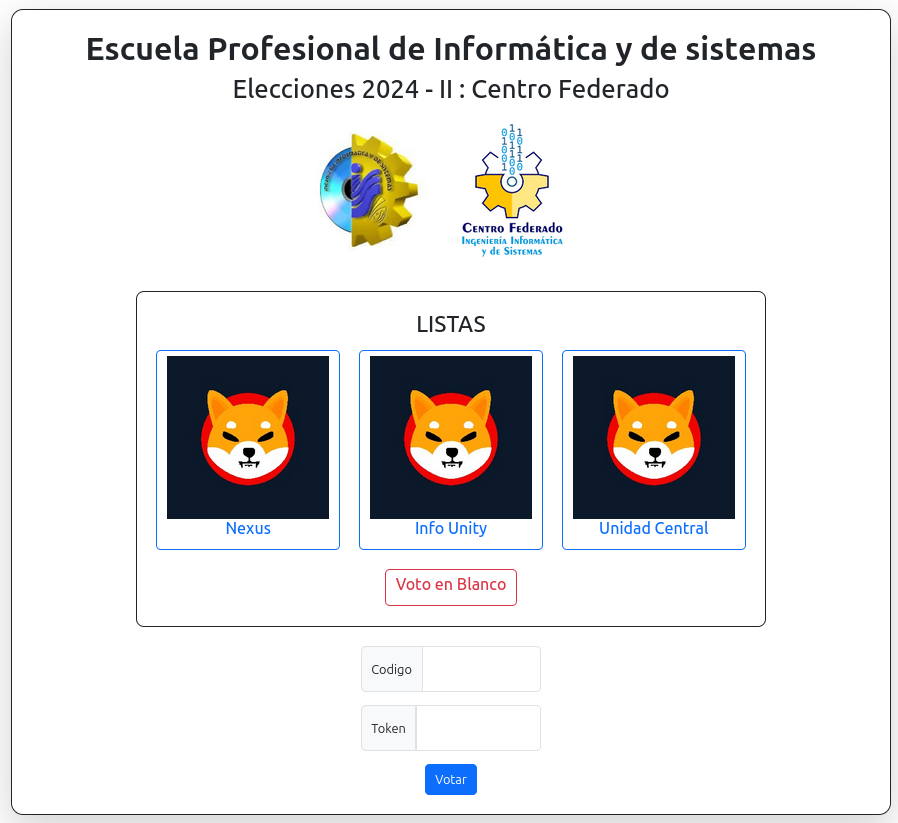
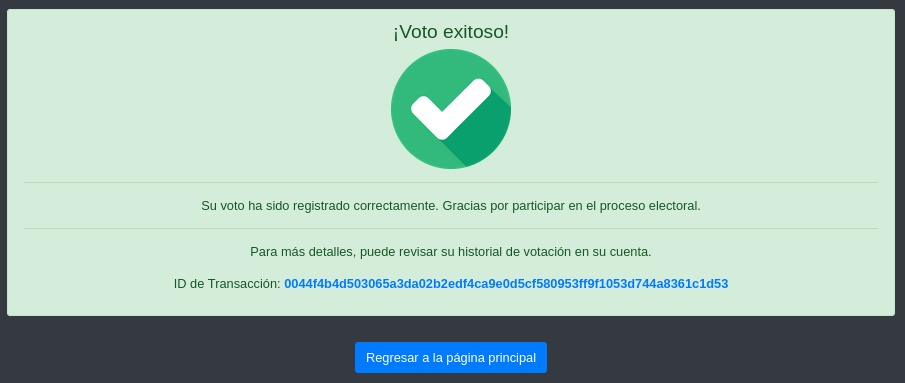

# SISTEMA DE VOTACIÓN DECENTRALIZADA

Este proyecto tiene como objetivo desarrollar un sistema de votación descentralizado que permita a los estudiantes de la Escuela Profesional de Informática y Sistemas de la UNSAAC realizar elecciones de manera segura, transparente y confiable. Utilizando tecnología blockchain, el sistema garantiza la integridad de los votos, previene manipulaciones y asegura el anonimato de los votantes.

Este proyecto se alinea con la mejora de los procesos internos de la Escuela Profesional de Informática y Sistemas y, en un marco más amplio, contribuir al desarrollo tecnológico de la UNSAAC. Al implementar un sistema de votación descentralizado, se busca modernizar y optimizar los procesos democráticos estudiantiles, fomentando la adopción de soluciones innovadoras que refuercen la transparencia, la seguridad y la confianza institucional.

# RECURSOS UTILIZADOS

## LARAVEL

### About Laravel

Laravel is a web application framework with expressive, elegant syntax. We believe development must be an enjoyable and creative experience to be truly fulfilling. Laravel takes the pain out of development by easing common tasks used in many web projects, such as:

-   [Simple, fast routing engine](https://laravel.com/docs/routing).
-   [Powerful dependency injection container](https://laravel.com/docs/container).
-   Multiple back-ends for [session](https://laravel.com/docs/session) and [cache](https://laravel.com/docs/cache) storage.
-   Expressive, intuitive [database ORM](https://laravel.com/docs/eloquent).
-   Database agnostic [schema migrations](https://laravel.com/docs/migrations).
-   [Robust background job processing](https://laravel.com/docs/queues).
-   [Real-time event broadcasting](https://laravel.com/docs/broadcasting).

Laravel is accessible, powerful, and provides tools required for large, robust applications.

### License

The Laravel framework is open-sourced software licensed under the [MIT license](https://opensource.org/licenses/MIT).

## MULTICHAIN

### About Multichain

MultiChain es una plataforma blockchain empresarial diseñada para facilitar la creación y despliegue de blockchains personalizables y aplicaciones distribuidas de manera rápida. Permite emitir y gestionar activos, realizar transacciones seguras, y crear bases de datos clave-valor o series temporales. Su sistema flexible de permisos y herramientas para desarrolladores reduce esfuerzos, ofreciendo control sobre las reglas de la red, almacenamiento de datos y seguridad. MultiChain soporta múltiples blockchains por servidor, adaptándose a diversas necesidades empresariales y entre cadenas.

-   [About Coin Sciences](https://www.multichain.com/about-coin-sciences-ltd/).

### TAGS

-   [Pagina oficial](https://www.multichain.com/).
-   [MultiChain for Developers](https://www.multichain.com/developers/#tutorials).
-   [MultiChain JSON-RPC API](https://www.multichain.com/developers/json-rpc-api/).
-   [multichain-explorer-2](https://github.com/MultiChain/multichain-explorer-2).
